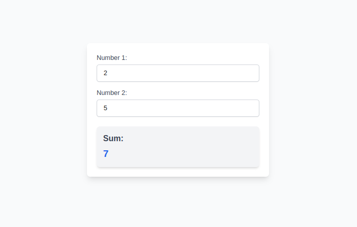

## Description

Next.js web app can add two numbers using Webassembly (WASM). It is deployed using fleek-next CLI



## Requirements

- Node.js
- Next.js CLI
- Fleek CLI
- Fleek-next CLI https://github.com/fleek-platform/fleek-next
- Rust https://www.rust-lang.org/tools/install
- Wasm-pack Rust CLI https://rustwasm.github.io/wasm-pack/installer/

```bash
npm install
npm run build-wasm
npm run build
npm run dev
```

Deploy to fleek using fleek-next

```
fleek projects create
fleek pat
fleek-next deploy
```

<!-- /wasm
[SGX WASM RUST](https://fleek.xyz/guides/getting-started-fleek-functions-edge-sgx/)

```
cargo init .
rustup target add wasm32-unknown-unknown
cargo build -r --target wasm32-unknown-unknown

``` -->
